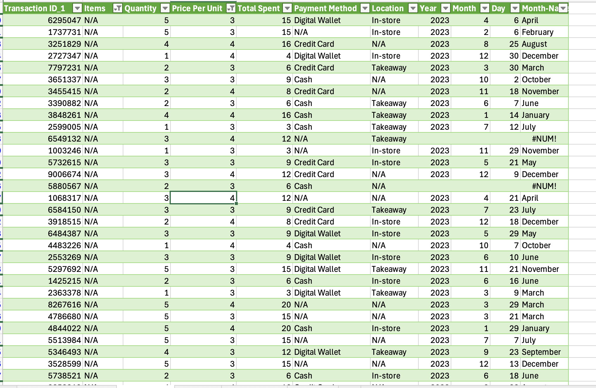

<h2>
 Data Cleaning for the Dirty_cafe_Sales.Csv
</h2>

Preview of the Raw data : 

Sheet dirty_cafe_sales - RAW Contains 
<table>
   <th>Columns</th>
   <tr>Transaction ID</tr>
   <tr>Items</tr>
   <tr>Price Per Unit</tr>
   <tr>Total Spend</tr>
   <tr>Payment Method</tr>
   <tr>Location</tr>
   <tr>Transaction Date</tr>
</table>

**Step taken: **

1. Check for duplicates - No duplicates
2. Remove TXT from the transaction ID - Keep only the useful information that we can use to identify each transaction
   Use the right function to obtain only the transaction number.

3. Fill out Quantity based on the TotalPrice, Price per Item:
   
  - Quantity =  TotalPrice / Price
  - Price = TotalPrice / Quantity
  - TotalPrice = Quantity * Price

4. Fill out the Item based on observing the prices of each item:

- Coffee	2
- Cookie	1
- Juice	3
- Salad	5
- Tea	1.5

5. With PowerQuery, transform the date into 3 parts: day, month, and year. 

6. There are products with the same price :
   - Sandwich - 4
   - Smoothies - 4
   - Juice - 3 
   - Cake - 3
Given this situation, all products with prices 3 and 4 will be classified as N/A.

 

7. Remove all unnecessary data that has missing information:

- Remove rows with N/A -  Replace all UNKNOWN , ERROR WITH N/A 
- Remove rows with EMTPY Quantity, ITEM NAME, AND PRICE 
- Remote rows with N/A ,ITEM NAME, NO QUANTY, NO TOTAL, ONLY PRICE PER ITEM

